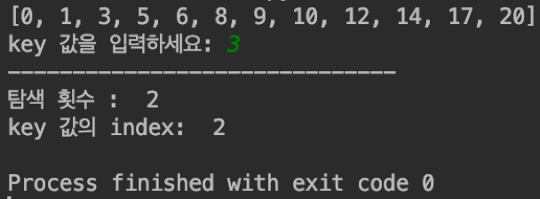
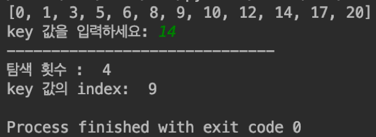
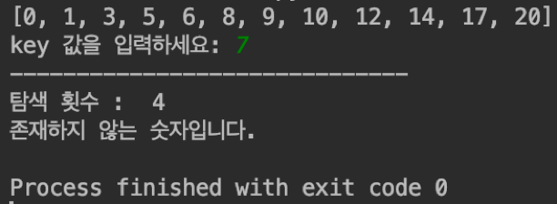
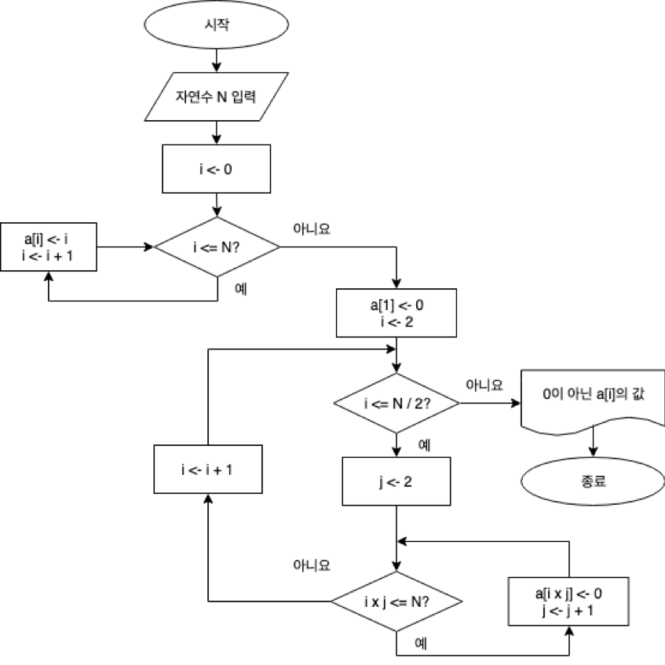
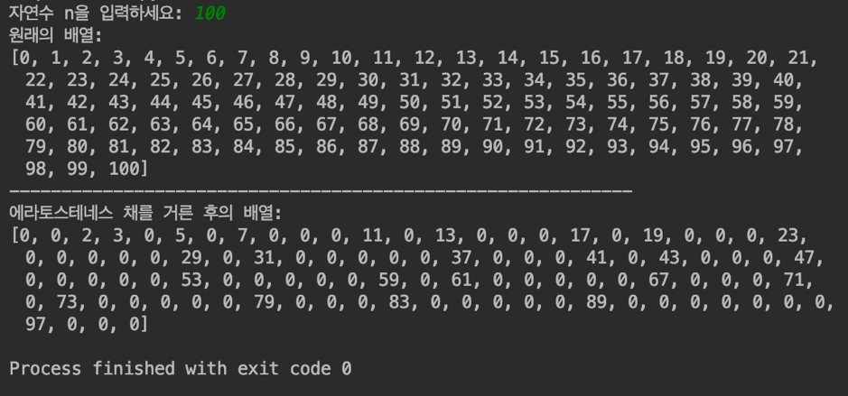
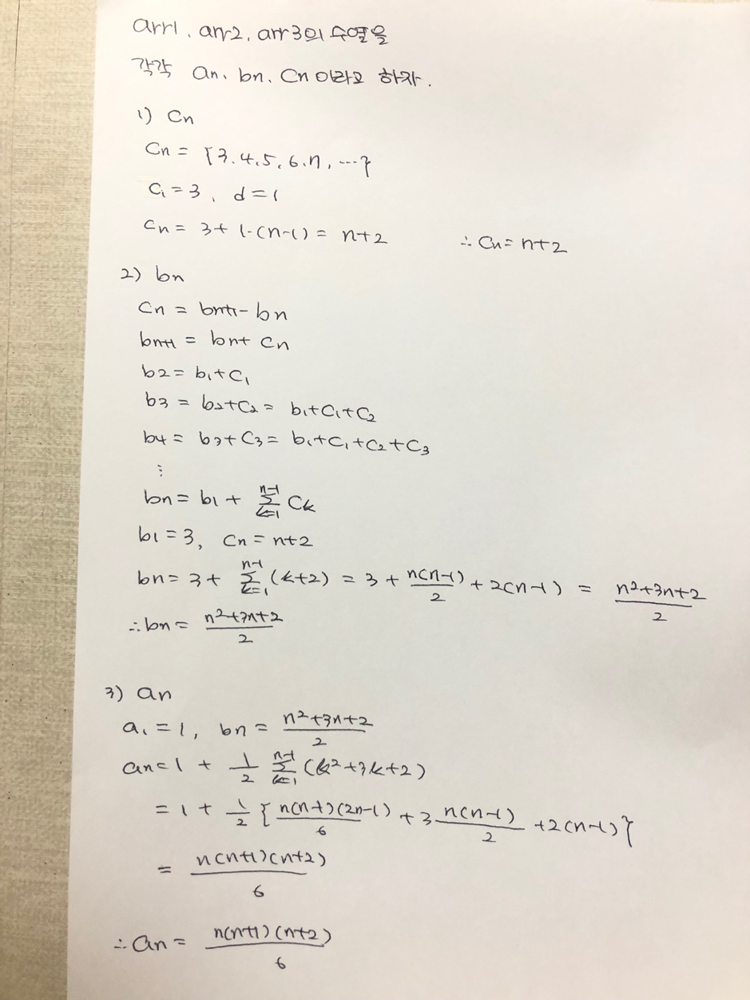

# 프로그래밍 실습 #1

## 1.다음과 같은 이진 탐색 알고리즘을 파이썬으로 작성하라.

```python
binarySearch(a[], key, left, right)
	// a[mid] = key인 인덱스 mid를 반환
	if (left <= right) then {
		mid ← (left + right) / 2;
		case {
			key = a[mid] : return mid;
			key < a[mid] : return binarySearch(a, key, left, mid-1);
			key > a[mid] : return binarySearch(a, key, mid+1, right);
		}
	}
	else return -1; // key 값이 존재하지 않음
end binarySearch()
```

### [코드]
[problem01.py](https://github.com/jaehui327/pythonAlgorithm/blob/master/programming%231/problem01.py)

### [실행결과]








## 2. 다음 물음에 답하라.
### (1) 0부터 N까지 N+1개의 정수로 이루어진 배열 a에 대해 에라토스테네스의 체(sieve of Eratosthenes) 기법을 사용하여 소수를 찾는 알고리즘을 순서도를 사용하여 작성하라. 이 알고리즘은 소수가 아닌 원소의 값을 0으로 바꾼다.

### [순서도]



### (2) 에라토스테네스의 채를 사용하여 소수를 찾는 프로그램을 파이썬으로 작성하라.

### [코드]
[problem02.py](https://github.com/jaehui327/pythonAlgorithm/blob/master/programming%231/problem02.py)

### [실행결과]



## 3. 다음 알고리즘을 파이썬으로 작성한 다음, 시간 복잡도를 구하라.

```python
for (i ← 1; i ≤ n; i ← i+1) do {
	for (j ← 1; j ≤ i; j ← j+1) do {
		for (k ← 1; k ≤ j; k ← k+1) do {
			x ← x + 1;
		}
	}
}
```

### [코드]
[problem03.py](https://github.com/jaehui327/pythonAlgorithm/blob/master/programming%231/problem03.py)


### [실행결과]


### [시간 복잡도 계산]




### [시간 복잡도]

O(N^3)