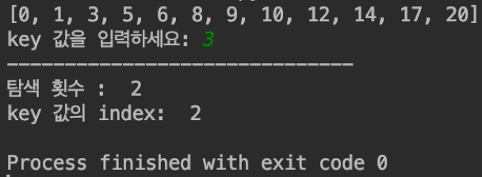
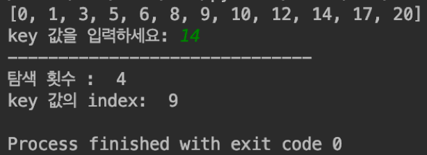
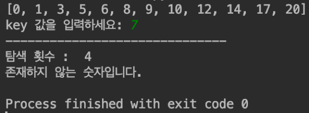
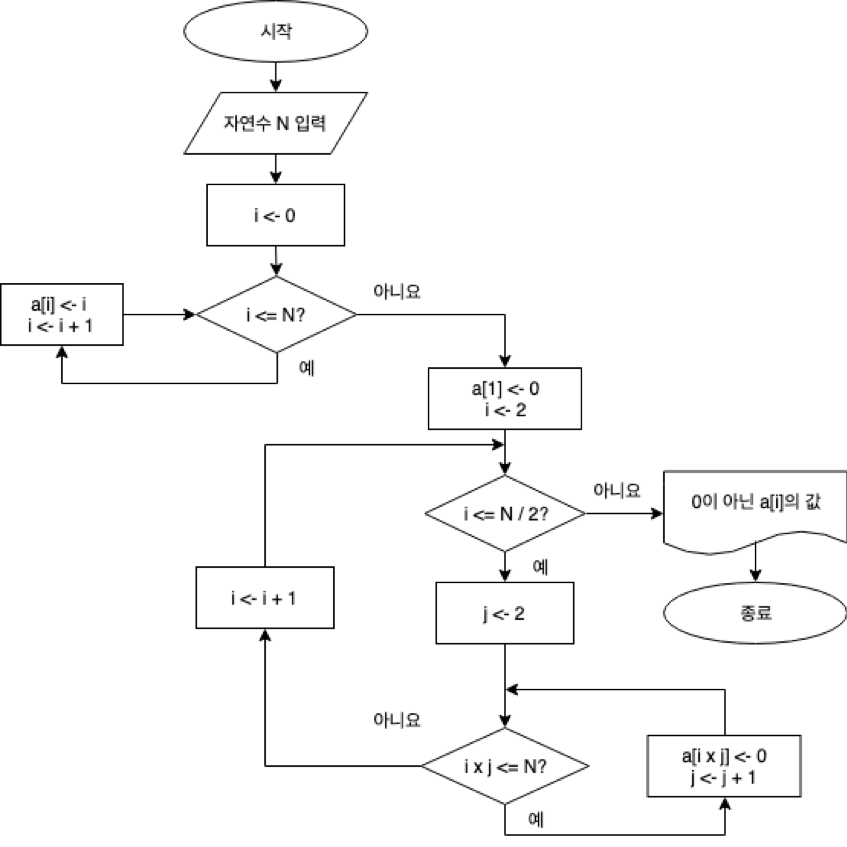
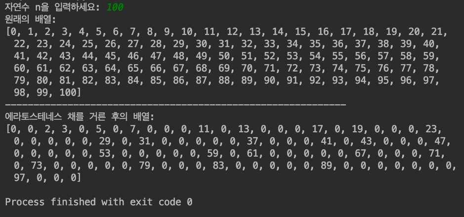
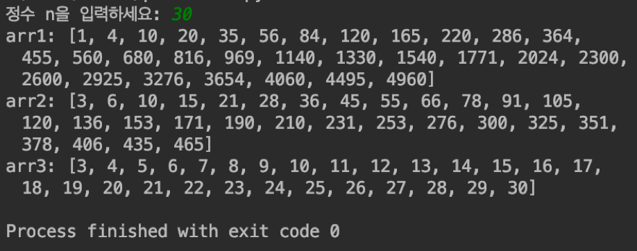
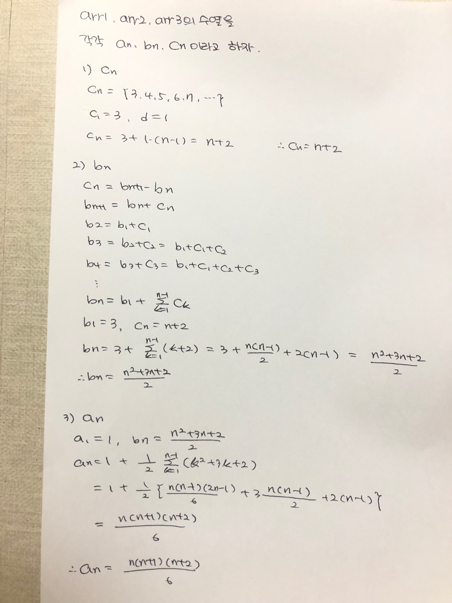

# 프로그래밍 실습 #1

## 1.다음과 같은 이진 탐색 알고리즘을 파이썬으로 작성하라.

```python
binarySearch(a[], key, left, right)
	// a[mid] = key인 인덱스 mid를 반환
	if (left <= right) then {
		mid ← (left + right) / 2;
		case {
			key = a[mid] : return mid;
			key < a[mid] : return binarySearch(a, key, left, mid-1);
			key > a[mid] : return binarySearch(a, key, mid+1, right);
		}
	}
	else return -1; // key 값이 존재하지 않음
end binarySearch()
```

### [코드]
```python
# 이진 탐색을 수행하는 함수
# a[mid] = key인 인덱스 mid를 반환하는 함수
def binarySearch(a, key, left, right):
    # 전역변수 times를 사용한다고 명시
    global times
    while left <= right:
        mid = (left + right) // 2
        if key == a[mid]:
            times += 1 
            return mid
        elif key < a[mid]:
            times += 1
            return binarySearch(a, key, left, mid - 1)
        else:
            times += 1
            return binarySearch(a, key, mid + 1, right)
    # key 값이 존재하지 않으면 -1을 반환
    return -1
# 이동 횟수를 저장하는 times
times = 0
# 임의로 정수 리스트 생성
a = [0, 1, 3, 5, 6, 8, 9, 10, 12, 14, 17, 20]
# 정수 리스트 출력
print(a)
# 찾을 숫자를 입력 받는 key
key = int(input("key 값을 입력하세요: "))
# binarySearch 함수의 리턴값인 인덱스를 res에 저장, 인덱스는 0부터 len(a) - 1까지
res = binarySearch(a, key, 0, len(a) - 1)

print("------------------------------")
print("탐색 횟수 : ", times)
if res == -1:
    print("존재하지 않는 숫자입니다.")
else:
    print("key 값의 index: ", res)
```

### [실행결과]








## 2. 다음 물음에 답하라.
### (1) 0부터 N까지 N+1개의 정수로 이루어진 배열 a에 대해 에라토스테네스의 체(sieve of Eratosthenes) 기법을 사용하여 소수를 찾는 알고리즘을 순서도를 사용하여 작성하라. 이 알고리즘은 소수가 아닌 원소의 값을 0으로 바꾼다.

### [순서도]



### (2) 에라토스테네스의 채를 사용하여 소수를 찾는 프로그램을 파이썬으로 작성하라.

### [코드]
```python
# 0부터 n까지의 정수에서 소수를 찾기 위해 n을 입력 받음
n = int(input("자연수 n을 입력하세요: "))
# 0부터 n까지의 정수 리스트 생성
a = list(range(0, n + 1));
# 정수 리스트 출력
print("원래의 배열:")
print(a)

# 1은 소수가 아니므로 0으로 치
a[1] = 0
# 2부터 n // 2 + 1보다 작을 때 까지 반복
for i in range(2, n // 2 + 1):
    # 2부터 소수이므로 j 초기화
    j = 2
    # n 까지의 정수에서 j의 배수를 모두 0으로 치환
    while (i * j <= n):
        a[i * j] = 0
        j += 1
# 에라토스테네스의 체를 거른 후의 배열 출력
print("------------------------------------------------------------")
print("에라토스테네스 채를 거른 후의 배열:")
print(a)
```

### [실행결과]



## 3. 다음 알고리즘을 파이썬으로 작성한 다음, 시간 복잡도를 구하라.

```python
for (i ← 1; i ≤ n; i ← i+1) do {
	for (j ← 1; j ≤ i; j ← j+1) do {
		for (k ← 1; k ≤ j; k ← k+1) do {
			x ← x + 1;
		}
	}
}
```

### [코드]
```swift
x = 0
arr1 = []
arr2 = []
arr3 = []
# 크기가 n인 정수 리스트를 만들기 위해 입력 받음
n = int(input("정수 n을 입력하세요: "))

# 사면체 수열 arr1
for i in range(1, n + 1):
    for j in range(1, i + 1):
        for k in range(1, j + 1):
          x += 1
    arr1.append(x)
# arr1 출력
print("arr1:", arr1)

# arr1의 계차수열 arr2
for i in range(1, len(arr1)):
  arr2.append(arr1[i] - arr1[i - 1])
# arr2 출력
print("arr2:", arr2)

# arr2의 계차수열 arr3
for i in range(1, len(arr2)):
  arr3.append(arr2[i] - arr2[i - 1])
# arr3 출력
print("arr3:", arr3)
```


### [실행결과]




### [시간 복잡도 계산]




### [시간 복잡도]

O(N^3)